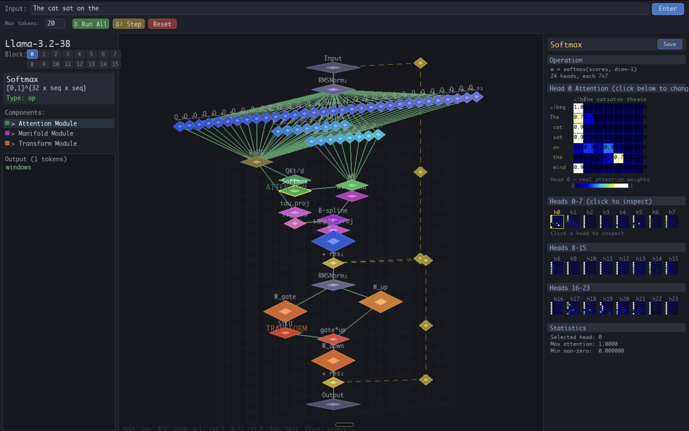

# LLM Inspector

Interactive isometric 3D visualizer for inspecting transformer block internals with B-spline curve attention (manifold mode).

Works with any HuggingFace causal language model. Supports real-time activation inspection, attention heatmaps, B-spline curve editing, and tag-based routing visualization.



## Setup

```bash
python -m venv venv
source venv/bin/activate
pip install -r requirements.txt
```

Requires Python 3.9+ and a HuggingFace account with access to gated models (e.g., LLaMA).

## Quick Start

```bash
# Download model + curve attention checkpoint
python download_model.py meta-llama/Llama-3.2-1B-Instruct

# Run inspector (standard mode)
python inspector.py --model models/Llama-3.2-1B-Instruct

# Run inspector (manifold mode — with B-spline curve attention)
python inspector.py --model models/Llama-3.2-1B-Instruct \
  --checkpoint checkpoints/formation.pt
```

## What is Manifold Mode?

In manifold mode, the attention mechanism uses B-spline curves for value aggregation. Each attention head's output is defined by control points on a smooth curve, which can be visualized and edited interactively.

- **Standard mode**: Standard transformer attention (Q, K, V projections + dot-product attention)
- **Manifold mode**: Curve Attention — V values become B-spline control points, queries determine WHERE to sample the curve

The curve attention checkpoint is trained separately (see [attention_on_bsplines](https://github.com/your-repo/attention_on_bsplines) for training scripts).

## GUI Layout

```
+-----------------------------------------------------+
| Input: [text here...] [Enter]  Max:[20] [Run] [Step]|
+----------+---------------------------+--------------+
| Model    |                           |              |
| name     |    Isometric 3D view      |  Right panel |
| Block    |    of transformer block   |  activations |
| selector |                           |  heatmaps    |
| + tree   |    Components:            |  B-spline    |
| + output |    RMSNorm, Q/K/V heads,  |  curve plot  |
|          |    RoPE, Softmax, MLP,    |  (editable)  |
|          |    residuals              |  controls    |
+----------+---------------------------+--------------+
```

## Controls

### Navigation
| Key | Action |
|-----|--------|
| A/D | Pan left/right |
| W/S | Zoom in/out |
| Q/E | Rotate Y axis |
| R/F | Rotate X axis |
| Tab | Cycle through components |
| Click | Select component |

### Curve Editing (Manifold Mode)
1. Select a block and head
2. Drag control points on the B-spline curve plot
3. Click **Apply** to see how edits change next-token predictions
4. Click **Step** to generate tokens with edits active
5. Click **Run All** to generate full output with edits
6. Click **Save** to export edits to `edits.json`
7. Click **Load** to import previously saved edits

### Sensitivity Analysis
Type `sensitivity` in the terminal after running a prompt. Shows which (layer, head) pairs are most sensitive to control point edits — focus your editing there.

```
cmd> sensitivity

  Rank  Layer  Head  Sensitivity  Bar
  ────  ─────  ────  ───────────  ────────────────────
     1      1    23    73.469138  ████████████████████
     2      0    13    60.763216  ████████████████░░░░
     3      0    18    41.068592  ███████████░░░░░░░░░
```

## Terminal Commands

Type in the terminal while the inspector is running:

```
run The cat sat on the mat        # run forward pass
save block 0 softmax head 5       # save attention data
save all heads block 0            # save all heads
select block 5                    # switch block
select head 10                    # switch head view
sensitivity                       # find most editable heads
status                            # show state
load edits path/to/edits.json     # load curve edits
save edits                        # save current edits
quit                              # exit
```

## Supported Models

Any HuggingFace `AutoModelForCausalLM`:
- **LLaMA** 3.2 (1B, 3B) — tested
- **Qwen2** (1.5B, 7B)
- **GPT-2**
- Others with standard transformer architecture

## Inference

Compare base model vs curve attention model:

```bash
python infer.py --model meta-llama/Llama-3.2-1B-Instruct \
  --formation checkpoints/formation.pt \
  --prompt "Explain the theory of relativity" \
  --max-tokens 100
```

## Tag-Based Routing

Steer generation through target concepts by editing B-spline sampling locations:

```bash
# Compare routed vs unrouted
python route.py --model meta-llama/Llama-3.2-1B-Instruct \
  --formation checkpoints/formation.pt \
  --prompt "Explain the theory of relativity" \
  --tags gravity Newton speed light force \
  --alpha 0.5 --compare

# Diagnostics: are tag fingerprints distinct?
python route.py --formation checkpoints/formation.pt \
  --diagnose --tags gravity Newton speed light force

# Export edits for the inspector
python route.py --model meta-llama/Llama-3.2-1B-Instruct \
  --formation checkpoints/formation.pt \
  --prompt "Explain the theory of relativity" \
  --tags gravity Newton speed light force \
  --alpha 0.5 --export-edits routing_edits.json
```

Then load `routing_edits.json` in the inspector to visualize and tweak the routing.

## Training

### Stage 1: Calibration (sync curve attention to standard attention)
```bash
python distill_attention.py --model meta-llama/Llama-3.2-1B-Instruct --R 64
```

### Stage 2: Formation (train curve params on clean data)
```bash
# Single GPU
python formation.py --model meta-llama/Llama-3.2-1B-Instruct \
  --checkpoint checkpoints/curve_attention.pt \
  --epochs 10 --lr 1e-4 --block-size 1024

# Multi-GPU
accelerate launch formation_multi_gpu.py \
  --model meta-llama/Llama-3.2-1B-Instruct \
  --checkpoint checkpoints/curve_attention.pt \
  --epochs 10 --lr 1e-4 --batch-size 4 --block-size 1024
```

### Stage 3: Route policy (learn tag-based spline editing)
```bash
python train_router.py --model meta-llama/Llama-3.2-1B-Instruct \
  --formation checkpoints/formation.pt \
  --epochs 20 --lr 5e-4 --lambda-route 0.3
```

## Files

| File | Description |
|------|-------------|
| `inspector.py` | Main GUI application (visualization + hooks + editing) |
| `prototype_curve_attention.py` | CurveAttention module (B-spline curve sampling) |
| `download_model.py` | Download models and checkpoints from HuggingFace |
| `infer.py` | Compare base vs curve attention inference |
| `route.py` | Tag-based routing (probe, route, export edits) |
| `train_router.py` | Train routing policy (spline curve addition) |
| `demo_edit.json` | Example curve edit file |
| `requirements.txt` | Python dependencies |

## Saved Data

Each session creates `runs/<timestamp>/`. Saved components go to `runs/<timestamp>/block_<N>/<component>/`:

- `info.json` — metadata, tokens, per-token stats
- `*.npy` — attention matrices, activations as numpy arrays
- `edits.json` — curve control point edits (loadable)
